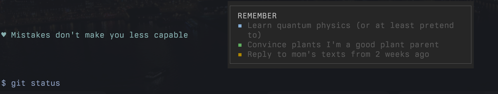
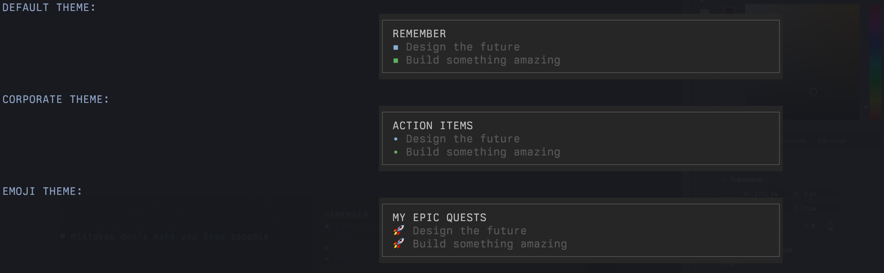
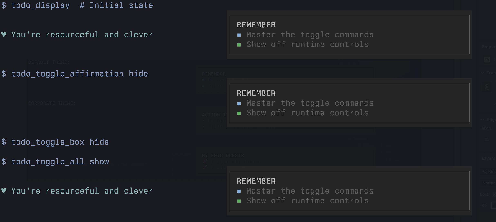

# zsh-todo-reminder

A beautiful, configurable zsh plugin that displays your TODO tasks in a right-aligned box with motivational affirmations above every terminal prompt.



## 📸 Screenshots

### Default Display


_Clean todo box with motivational affirmations_

### Customization Options


_Different themes showing title, bullet, and styling flexibility_

### Runtime Controls


_Show/hide components on-the-fly without restart_

## ✨ Features

- **🎨 Beautiful Display**: Right-aligned todo box with Unicode borders that appears above every prompt
- **💝 Motivational Affirmations**: Fetches daily affirmations to keep you motivated
- **📜 Persistent Reminders**: Tasks stay visible in your terminal history as you work
- **⚙️ Fully Configurable**: Customize title, colors, box width, and more
- **🚀 Non-Blocking**: Never slows down your terminal, even with network issues
- **📦 Single File Storage**: Clean, consolidated save format
- **🔍 Smart Completion**: Tab completion for task removal
- **📱 Responsive**: Adapts to terminal width changes

## 🚀 Quick Start

### Installation

**With Antidote:**

```bash
# Add to your .zsh_plugins.txt
kindjie/zsh-todo-reminder kind:defer
```

**With Oh My Zsh:**

```bash
git clone https://github.com/kindjie/zsh-todo-reminder ~/.oh-my-zsh/custom/plugins/reminder
# Add 'reminder' to your plugins list in ~/.zshrc
```

**Manual Installation:**

```bash
git clone https://github.com/kindjie/zsh-todo-reminder
# Source the plugin in your .zshrc:
source /path/to/zsh-todo-reminder/reminder.plugin.zsh
```

### Basic Usage

```bash
# Get help anytime
$ todo help

# Add a task (because your brain is not a hard drive)
$ todo "Stop procrastinating and finish that thing"
$ todo "Feed the cat before it stages a revolt"
$ todo "Reply to mom's texts from 2 weeks ago"

# Remove a completed task (with tab completion because we're fancy)
$ todo done "Stop proc"  # Tab completion saves your sanity

# Tasks haunt you automatically before each prompt ✨
```

### Example Terminal Session

```bash
~/projects main
❯ todo "Fix authentication bug"
Task added: Fix authentication bug

                                                      ┌────────────────────────────┐
                                                      │ REMEMBER                   │
♥ You are stronger than you think                     │ ▪ Fix authentication bug   │
                                                      └────────────────────────────┘
~/projects main
❯ cd awesome-app

                                                      ┌────────────────────────────┐
                                                      │ REMEMBER                   │
♥ You are stronger than you think                     │ ▪ Fix authentication bug   │
                                                      └────────────────────────────┘
~/projects/awesome-app main
❯ npm test
# ... test output ...

                                                      ┌────────────────────────────┐
                                                      │ REMEMBER                   │
♥ You are stronger than you think                     │ ▪ Fix authentication bug   │
                                                      └────────────────────────────┘
~/projects/awesome-app main
❯ todo done "Fix auth"
Task completed: Fix authentication bug

~/projects/awesome-app main
❯
```

Notice how your todos appear before every prompt, keeping them visible as you work! When all tasks are completed, the todo box disappears for a clean terminal experience.

## 📖 Usage

### Quick Help

```bash
# Show essential commands
$ todo help

# Show full documentation and advanced features
$ todo help --full
```

The help command provides a quick reference with:

- All available commands and their usage
- Configuration options with defaults
- File locations
- Practical examples
- Link to full documentation

### Adding Tasks

```bash
todo "Learn quantum physics (or at least pretend to)"
todo "Convince plants I'm a good plant parent"
todo "Figure out why the printer hates me specifically"
```

### Completing Tasks

```bash
# Remove by partial match (because typing is hard)
todo done "Learn quantum"

# Example: Victory dance after removing a task!
todo done "Convince"  # 🎉 Plant parent status: achieved
```

### Display

- Tasks appear in a right-aligned box before each prompt
- Motivational affirmations appear on the left side
- Color-coded bullets (▪) for visual organization
- Automatic text wrapping for long tasks

## 🎛️ Advanced Features

### Setup Wizard

Get started quickly with the interactive setup:

```bash
todo setup
```

The wizard walks you through:
- Title and character customization
- Color schemes and themes
- Box dimensions and positioning
- Component visibility controls

### Configuration Management

```bash
# Export your current settings
todo config export my-settings.conf

# Import a configuration file
todo config import my-settings.conf

# Apply semantic intensity presets
todo config preset subtle      # Minimal decoration, muted colors
todo config preset balanced    # Professional appearance, moderate colors
todo config preset vibrant     # Bright colors, full decoration
todo config preset loud        # Maximum contrast, high visibility

# Save your current setup as a preset
todo config save-preset my-theme
```

### Theme Integration

For advanced theming with 200+ color schemes, install [tinty](https://github.com/tinted-theming/tinty) and [tinted-shell](https://github.com/tinted-theming/tinted-shell):

```bash
# Apply any tinted-shell theme
tinty apply gruvbox-dark-medium

# Presets automatically adapt to your terminal theme when available
todo config preset vibrant  # Uses colors from your active theme
```

### Color Reference

```bash
# See all 256 terminal colors with examples
todo help --colors
```

## ⚙️ Configuration

Set these variables **before** sourcing the plugin:

```bash
# Box appearance
export TODO_TITLE="TASKS"                    # Box title (default: "REMEMBER")
export TODO_BOX_WIDTH_FRACTION=0.4           # 40% of terminal width (default: 0.5)
export TODO_BOX_MIN_WIDTH=25                 # Minimum width (default: 30)
export TODO_BOX_MAX_WIDTH=70                 # Maximum width (default: 80)

# Character styling
export TODO_HEART_CHAR="💖"                  # Heart character (default: "♥")
export TODO_HEART_POSITION="both"            # "left", "right", "both", "none" (default: "left")
export TODO_BULLET_CHAR="🔸"                 # Task bullet character (default: "▪")

# Box drawing characters
export TODO_BOX_TOP_LEFT="┌"                 # Top left corner (default: "┌")
export TODO_BOX_TOP_RIGHT="┐"                # Top right corner (default: "┐")
export TODO_BOX_BOTTOM_LEFT="└"              # Bottom left corner (default: "└")
export TODO_BOX_BOTTOM_RIGHT="┘"             # Bottom right corner (default: "┘")
export TODO_BOX_HORIZONTAL="─"               # Horizontal line (default: "─")
export TODO_BOX_VERTICAL="│"                 # Vertical line (default: "│")

# Show/hide configuration
export TODO_SHOW_AFFIRMATION="false"         # Show affirmations: "true", "false" (default: "true")
export TODO_SHOW_TODO_BOX="true"             # Show todo box: "true", "false" (default: "true")
export TODO_SHOW_HINTS="false"               # Show contextual hints: "true", "false" (default: "true")

# Padding/margin (in characters)
export TODO_PADDING_TOP=1                    # Top padding/margin (default: 0)
export TODO_PADDING_RIGHT=2                  # Right padding/margin (default: 4)
export TODO_PADDING_BOTTOM=1                 # Bottom padding/margin (default: 0)
export TODO_PADDING_LEFT=4                   # Left padding/margin (default: 0)

# Color configuration (256-color terminal codes)
export TODO_TASK_COLORS="196,46,33,21,129,201"  # Task bullet colors (default: "167,71,136,110,139,73")
export TODO_BORDER_COLOR=244                 # Box border foreground color (default: 240)
export TODO_BORDER_BG_COLOR=233              # Box border background color (default: 235)
export TODO_CONTENT_BG_COLOR=234             # Box content background color (default: 235)
export TODO_TEXT_COLOR=245                   # Task text color (legacy, default: 240)
export TODO_TASK_TEXT_COLOR=245              # Task text color (default: 240)
export TODO_TITLE_COLOR=255                  # Box title color (default: 250)
export TODO_AFFIRMATION_COLOR=33             # Affirmation text color (default: 109)
export TODO_BULLET_COLOR=39                  # Bullet character color (default: 39)

# Legacy compatibility
export TODO_BACKGROUND_COLOR=235             # Sets both border and content bg if new vars not set

# File locations
export TODO_SAVE_FILE="$HOME/.my_todos"      # Save location (default: ~/.todo.save)
export TODO_AFFIRMATION_FILE="/tmp/affirm"   # Affirmation cache (default: /tmp/todo_affirmation)
```

## 🎨 Customization Examples

### The "I'm Too Cool for Hearts" Setup

```bash
export TODO_TITLE="STUFF"
export TODO_HEART_CHAR="-"
export TODO_BOX_WIDTH_FRACTION=0.3
```

### The "I Have a Giant Monitor" Display

```bash
export TODO_BOX_WIDTH_FRACTION=0.7
export TODO_BOX_MAX_WIDTH=100
# Because why not use ALL the pixels?
```

### The "Corporate Buzzword" Title

```bash
export TODO_TITLE="ACTION ITEMS"
# Now you sound important in meetings
```

### Affirmation Styles

```bash
# The "I Don't Need Feelings" Mode
export TODO_HEART_POSITION="none"

# The "Right-Side Heart Gang"
export TODO_HEART_POSITION="right"

# The "Maximum Cuteness Overload"
export TODO_HEART_POSITION="both"
export TODO_HEART_CHAR="💖"
export TODO_BULLET_CHAR="✨"
# ✨ Your terminal will thank you ✨
```

### The "Emoji Enthusiast" Setup

```bash
export TODO_HEART_CHAR="🌟"
export TODO_BULLET_CHAR="🚀"
export TODO_TITLE="MY EPIC QUESTS"
# Because everything is better with rockets
```

### The "Minimalist Zen Master"

```bash
export TODO_HEART_POSITION="none"
export TODO_BULLET_CHAR="·"
export TODO_TITLE="FOCUS"
export TODO_PADDING_TOP=2
export TODO_PADDING_BOTTOM=2
# Breathe in, breathe out, get stuff done
```

### The "Ultra Spaced Out" Display

```bash
export TODO_PADDING_TOP=3
export TODO_PADDING_RIGHT=10
export TODO_PADDING_BOTTOM=2
export TODO_PADDING_LEFT=8
# For when you need some breathing room
```

### The "Custom Color Scheme" Setup

```bash
export TODO_TASK_COLORS="196,46,33,21,129,201"  # Bright and vibrant task colors
export TODO_BORDER_COLOR=244                     # Lighter border foreground
export TODO_BORDER_BG_COLOR=233                  # Dark border background
export TODO_CONTENT_BG_COLOR=234                 # Slightly lighter content background
export TODO_TASK_TEXT_COLOR=255                  # Bright white task text
export TODO_TITLE_COLOR=226                      # Golden title
export TODO_AFFIRMATION_COLOR=33                 # Blue affirmations
export TODO_BULLET_COLOR=196                     # Red bullet points
# Make it uniquely yours
```

### The "High Contrast Border" Setup

```bash
export TODO_BORDER_COLOR=255                     # Bright white border
export TODO_BORDER_BG_COLOR=196                  # Red border background
export TODO_CONTENT_BG_COLOR=235                 # Normal content background
# Make your borders pop!
```

### The "Stealth Mode" Setup

```bash
export TODO_SHOW_AFFIRMATION="false"
export TODO_SHOW_TODO_BOX="false"
# Hide everything (but why would you want to?!)
```

### Box Style Variations

```bash
# ASCII Style (for purists)
export TODO_BOX_TOP_LEFT="+"
export TODO_BOX_TOP_RIGHT="+"
export TODO_BOX_BOTTOM_LEFT="+"
export TODO_BOX_BOTTOM_RIGHT="+"
export TODO_BOX_HORIZONTAL="-"
export TODO_BOX_VERTICAL="|"
# +---------------------------+
# | REMEMBER                  |
# | - Buy coffee              |
# +---------------------------+

# Double-line Style (fancy!)
export TODO_BOX_TOP_LEFT="╔"
export TODO_BOX_TOP_RIGHT="╗"
export TODO_BOX_BOTTOM_LEFT="╚"
export TODO_BOX_BOTTOM_RIGHT="╝"
export TODO_BOX_HORIZONTAL="═"
export TODO_BOX_VERTICAL="║"
# ╔═══════════════════════════╗
# ║ REMEMBER                  ║
# ║ ▪ Look professional       ║
# ╚═══════════════════════════╝

# Rounded Corners (smooth vibes)
export TODO_BOX_TOP_LEFT="╭"
export TODO_BOX_TOP_RIGHT="╮"
export TODO_BOX_BOTTOM_LEFT="╰"
export TODO_BOX_BOTTOM_RIGHT="╯"
# ╭───────────────────────────╮
# │ REMEMBER                  │
# │ ▪ Stay zen                │
# ╰───────────────────────────╯

# Heavy Style (make a statement)
export TODO_BOX_TOP_LEFT="┏"
export TODO_BOX_TOP_RIGHT="┓"
export TODO_BOX_BOTTOM_LEFT="┗"
export TODO_BOX_BOTTOM_RIGHT="┛"
export TODO_BOX_HORIZONTAL="━"
export TODO_BOX_VERTICAL="┃"
# ┏━━━━━━━━━━━━━━━━━━━━━━━━━━━┓
# ┃ REMEMBER                  ┃
# ┃ ▪ Be bold                 ┃
# ┗━━━━━━━━━━━━━━━━━━━━━━━━━━━┛
```

## 🎛️ Runtime Controls

You can show, hide, or toggle components on the fly without restarting your shell:

### Toggle Commands

```bash
# Affirmation controls
todo toggle affirmation          # Toggle affirmations on/off
todo toggle affirmation show     # Show affirmations
todo toggle affirmation hide     # Hide affirmations

# Todo box controls  
todo toggle box                  # Toggle todo box on/off
todo toggle box show             # Show todo box
todo toggle box hide             # Hide todo box

# Control everything at once
todo toggle all                  # Toggle both affirmations and todo box
todo toggle all show             # Show everything
todo toggle all hide             # Hide everything (why though?)

# Quick shortcuts
todo hide                        # Hide everything 
todo show                        # Show everything
```

### Quick Examples

```bash
# Having a presentation? Hide the distractions
$ todo hide
Affirmations and todo box disabled

# Back to productivity mode
$ todo toggle affirmation show
Affirmations enabled

# Need focus? Just the todos, please
$ todo toggle affirmation hide && todo toggle box show
Affirmations disabled
Todo box enabled
```

## 🛠️ Technical Details

### File Format

Tasks are stored in `~/.todo.save` with this format:

- Line 1: Tasks (null-byte separated)
- Line 2: Colors (null-byte separated)
- Line 3: Next color index

### Dependencies

- **Required**: `zsh` with color support
- **Optional**: `curl` and `jq` for affirmations (graceful degradation if missing)

### Performance

- Non-blocking affirmation fetching
- Minimal startup overhead
- Responsive to terminal resizing

### Emoji Support

- Full emoji character width detection for proper box alignment
- Supports emojis in both bullet and heart characters
- Works with all Unicode character types including:
  - Standard emojis (🚀, 💖, 🔥, ✨)
  - CJK wide characters (中, あ, 한)
  - Unicode symbols (♥, ▪, →, ★)

### Display Behavior

- **Empty todo list**: When all tasks are completed, the todo box disappears completely for a clean terminal
- **Long affirmations**: Automatically truncated with "..." when they exceed available space
  - Truncation accounts for heart position configuration
  - Ensures clean display even in narrow terminals
- **Text wrapping**: Long todo items wrap within the box boundaries
- **Responsive layout**: Box width adjusts based on terminal size and configuration

## 🧪 Testing

### Complete Test Suite

Run ALL tests by default (functional, performance, UX, documentation):

```bash
./tests/test.zsh
```

### Quick Functional Tests

Run only the core functional tests:

```bash
./tests/test.zsh --only-functional
```

### Individual Test Modules

Run specific test categories:

```bash
./tests/test.zsh display.zsh configuration.zsh  # Specific tests
./tests/performance.zsh                            # Performance only
```

### Test Coverage

**Functional Tests (100+ tests):**

- Display functionality with custom bullet/heart characters
- Configuration options including padding, colors, and dimensions
- Toggle command functionality and show/hide state management
- Character width detection for ASCII, Unicode, and emojis
- Interface commands, help system, and error handling
- Color validation and interactive color reference

**Performance Tests (16 tests):**

- Display performance under various conditions (< 50ms)
- Network timeout behavior (ensures non-blocking async design)
- Cache vs network performance validation
- Missing dependencies graceful degradation
- Memory usage monitoring and leak detection
- Background process cleanup verification

### Visual Padding Demo

See padding effects in action:

```bash
./demo_padding.zsh
```

The demo script shows:

- How padding affects both affirmation and todo box positioning
- Edge alignment with zero padding
- Affirmation truncation with extreme padding values
- Visual borders to clearly show padding boundaries
- All padding combinations (top/right/bottom/left)

## 🐛 Troubleshooting

### Quick Help

```bash
# First, get help to see all available commands
$ todo help
```

### Plugin not loading

If tasks don't appear in new terminals:

1. Verify the plugin is loaded: `which todo`
2. Check available commands: `todo help`
3. Check that you've sourced the plugin correctly
4. Try manually sourcing: `source path/to/reminder.plugin.zsh`

### Affirmations not appearing

- Affirmations require `curl` and `jq` (optional dependencies)
- Install with: `brew install curl jq` or your package manager
- Plugin works normally without affirmations if dependencies are missing

### Box width issues

- Ensure `TODO_BOX_MIN_WIDTH` < `TODO_BOX_MAX_WIDTH`
- Check terminal width is sufficient for your minimum width setting

## 🔧 How It Works

The plugin uses zsh's `precmd` hook to display your todos before each prompt:

1. **precmd hook**: Runs `todo_display` before every prompt is drawn
2. **Display pipeline**: Fetches tasks → formats box → prints above prompt
3. **Persistent visibility**: Each display becomes part of your terminal history
4. **Non-blocking design**: Affirmations fetch asynchronously in background
5. **Smart rendering**: Calculates terminal width and wraps text accordingly

This means:

- Your todos appear automatically - no manual commands needed
- They stay visible in scrollback as you work through commands
- New terminals immediately show existing tasks from `~/.todo.save`
- Performance is optimized to never slow down your prompt

## 📜 License

MIT License - see [LICENSE](LICENSE) file.

## 💭 Motivation

This project started as an experiment in "vibe coding" - letting an AI agent handle the implementation while I focused on the vision. As someone who works with LLMs professionally, I was skeptical about their capabilities for real development work. But I needed a simple terminal todo list, and this seemed like the perfect low-stakes testing ground.

I purposely chose to build on an existing plugin rather than start from scratch, to test how well AI could understand and extend established code. What began as right-aligned text became something unexpectedly polished through countless iterations of guidance and refinement.

### Observations from the Process

- **Testing was critical**: Progress was nearly impossible without comprehensive automated tests. Setting up an environment that accurately reflected rendered terminal output took several attempts.
- **Visual feedback essential**: Screenshots pasted into Claude Code were necessary to make progress on display issues. The AI couldn't accurately visualize terminal rendering from code alone.
- **Context management matters**: With limited context windows, I had to encourage documentation and strategically break up tasks to use `/clear` instead of `/compact`. The project consumed hundreds of thousands of tokens - I consistently hit Pro limits and needed to upgrade.
- **Not everything worked**: Some features had to be abandoned after thousands of tokens of failed attempts, like a transient display mode that would only show above the current prompt. The AI struggled to reason about interactions with other zsh plugins like P10k.
- **Surprisingly engaging**: The process was far more fun than solo coding - whether due to novelty or something inherent to collaborative AI development remains to be seen.
- **Interesting side effects**: The motivational affirmations in test outputs seemed to subtly influence the AI's personality as contexts grew larger.

Whether this demonstrates AI as a capable development partner is for you to decide - I'd love to hear your thoughts via GitHub issues!

## 🙏 Credits

Originally inspired by [AlexisBRENON/oh-my-zsh-reminder](https://github.com/AlexisBRENON/oh-my-zsh-reminder), but completely rewritten with new architecture, features, and goals.

Special thanks to Claude (that's me! 🤖) for making this README way more entertaining and helping with the quirky examples. I may be an AI, but I have excellent taste in humor.

## 🤝 Contributing

1. Fork the repository
2. Create a feature branch
3. Run tests: `./tests/test.zsh` (runs all tests) or `./tests/test.zsh --only-functional` (faster)
4. Submit a pull request

### Development Testing

- **Quick validation:** `./tests/test.zsh --only-functional` (~10s)
- **Comprehensive testing:** `./tests/test.zsh` (~60s, runs all tests)
- **Performance testing:** `./tests/performance.zsh` (network, async, timing)
- **Visual testing:** `./demo_padding.zsh` (padding demonstration)

---

_Keep your goals visible, stay motivated! ♥_

